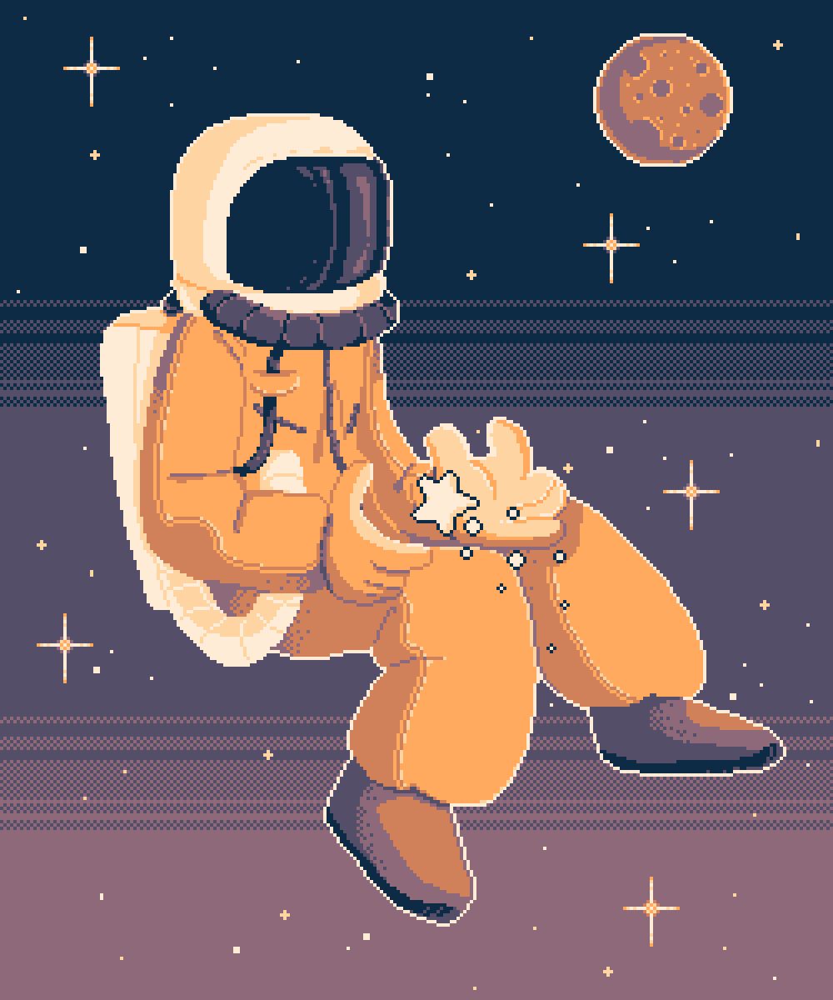

<h1 align="center">Olá! Eu sou Pedro Augusto Stabach 👋</h1>

  

---

## 🚀 Sobre mim

- 💻 Desenvolvedor apaixonado por resolver problemas com código.
- 📚 Sempre estudando novas tecnologias e aprimorando as que já domino.
- 🧰Desenvolvedor de frameworks NestJs e NextJs
- ⚡ Geek, gamer, fã de astronomia e programação.

---

## 🛠️ Tecnologias que mais uso

---

## 🌐 Conecte-se comigo

  
    

---

## 💼 Portfólio

| Projeto | Descrição | Tecnologias |
| -------- | --------- | ----------- |
|[Portfolio](https://github.com/PedroStabach/portfolio)) | Meu Portfolio Atual |  |
|[to-do-list](https://github.com/PedroStabach/to-do-list) | Cansado do desperdicio de alimentos em casa? Nossa aplicação pode salvar seus alimentos! |  |
|[Surl](https://github.com/PedroStabach/Surl) | URL escalavel, urls pequenas|  |

---

## 📈 GitHub Stats

  

  

  

---

  

